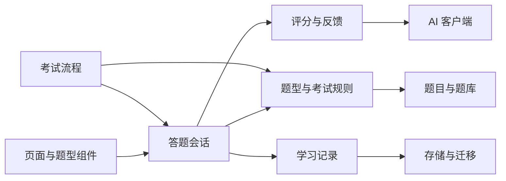

# DET Practice Lab 重构审计

> 日期：2026-09-04  
> 状态：第一阶段基线。本文记录当前证据和决策，后续实现以此为入口。

## 1. 产品目标

把当前“题型功能集合”重构为完整备考闭环：确定目标 → 获得今日任务 → 作答 → 得到有证据的反馈 → 针对弱项复练 → 用模拟考试验证进步。

Arno 只作为产品组织参考。其公开页面将无限专项练习、模拟考试、AI 反馈、个性化学习计划和词汇复习连接成一条学习路径。考试题型、时间和评分口径必须以 DET 官方资料为准，不能从竞品页面推断。

参考：

- Arno 产品页：https://goarno.io/
- DET 2025 Interactive Speaking 更新：https://testcenter.zendesk.com/hc/en-us/articles/36094897057421-Test-Update-New-Interactive-Speaking-questions
- 当前题型差异表：[`CURRENT_DET_RULES.md`](CURRENT_DET_RULES.md)

## 2. 基线结论

### 可以保留

- `js/engine.js`、`js/storage.js`、`js/ai.js` 已具备纯函数、依赖注入和 Node 单测基础。
- 本地题库、无 Key 客观题练习、错题和收藏具有离线价值。
- 练习态与考试态已有 `body.testing` 边界。
- 2026-09-04 基线单测：原有 39/39 通过；答题会话与当前规则契约加入后共 45/45 通过。

### 必须优先修正

| 优先级 | 发现 | 代码证据 | 影响 | 决策 |
|---|---|---|---|---|
| P0 | 模拟考试的词汇判断曾自动代答，并随机模拟约 70% 正确率 | `index.html` 的 `setupTestMode` | 用户未作答也会产生答案，模考结果失真 | 已删除生产路径中的测试驱动；测试用例自行操作页面 |
| P0 | “官方流程”仍按 2024-07 结构包含 Read Aloud | `OFFICIAL_SECTION_PLAN`、`buildOfficialStepList` | 与当前考试不一致 | 已改名为“2024 旧版流程”并降低入口层级；建立版本化规则后再上线当前模拟 |
| P0 | 本地静态服务器可读取根目录任意文件，包含 `server.env` | `server.py do_GET` | 访问者可能下载服务端密钥 | 静态资源改为白名单并补服务器测试 |
| P1 | 页面脚本同时管理 DOM、答案、计时、考试推进与记录 | `renderLT`、`submitLT`、`testNext` 等 | 重复提交和异步竞态难以控制 | 引入可测试的答题会话层，按题型逐个迁移 |
| P1 | 自定义正确率到 160 分换算容易被理解成官方成绩 | `scale100To160`、`objectiveDetScore` | 反馈的可信边界不清晰 | UI 分开显示原始表现与“练习估分”；记录评分规则版本 |
| P1 | 口语主链路主要保存浏览器语音识别文本 | `startRecord`、`submitSpeak` | 无法回听，发音和流利度缺少声学证据 | 保存音频、转写和评分三个独立对象；无证据维度显示未评估 |
| P2 | 题型需在多个全局表和渲染器中同步修改 | `TC`、`BANK`、`TABORDER`、`RENDERERS` 等 | 容易出现配置漂移 | 建立单一题型清单和契约校验 |
| P2 | 文档称目录不是 Git 仓库，与实际状态不符 | `AGENTS.md`、`docs/ARCHITECTURE.md` | 开发基线失真 | 后续文档更新时统一纠正 |

## 3. 考试规则差异

已确认的官方变化：自 2025-07-01 起，Interactive Speaking 加入考试；Listen, Then Speak 被替代；Read Aloud 被移除。Interactive Speaking 为 6–8 轮模拟对话，每轮听题后有 35 秒录音，后续问题会参考此前回答。

当前代码仍把 `ra` 放在所谓官方流程中，并保留 `rtsp`。在完成当前官方题型、频次、计时和评分贡献表之前，产品不得把该流程称为“全真”或“当前官方流程”。

## 4. 架构目标

边界要求：

- 页面不直接决定考试下一步，也不生成测试答案。
- 一次提交只有一个结果；按钮、超时和异步回调共用幂等提交。
- 题型规则包含版本和生效日期。
- 评分结果记录 `kind`（正确率、练习估分、模考估分）、规则版本和证据来源。
- 数据迁移保留当前九个 localStorage key 的兼容读取。

## 5. 第一条纵向流程：听写

选择听写是因为它覆盖选题、播放、计时、答案、客观评分、反馈和历史记录。

本阶段接入 `js/session.js`：

1. 渲染时创建会话；
2. 首次播放时开始会话；
3. 输入变化写入会话；
4. 手动提交和超时提交共用幂等入口；
5. 历史详情保存会话摘要。

这条流程通过后，再把相同协议扩到完形、词汇判断和考试流程。

## 6. 验收门禁

- 纯模块单测通过；涉及引擎、存储、AI 时运行现有 39 项单测。
- 涉及页面、题型或考试流时运行 `smoke.js`。
- 手动检查无操作时不会自动代答，超时与按钮同时触发只记一次。
- 360、768、1440 px 无横向滚动；键盘焦点和移动端抽屉可用。
- 用户可见位置不出现未经验证的“官方分数”“全真”“当前官方流程”。
